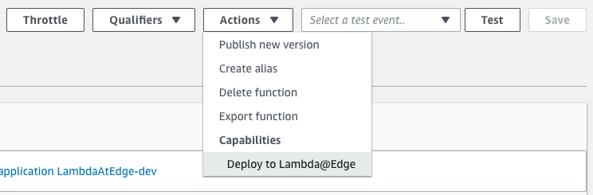
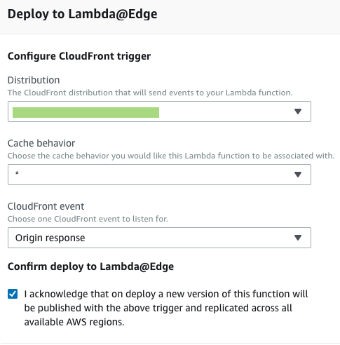
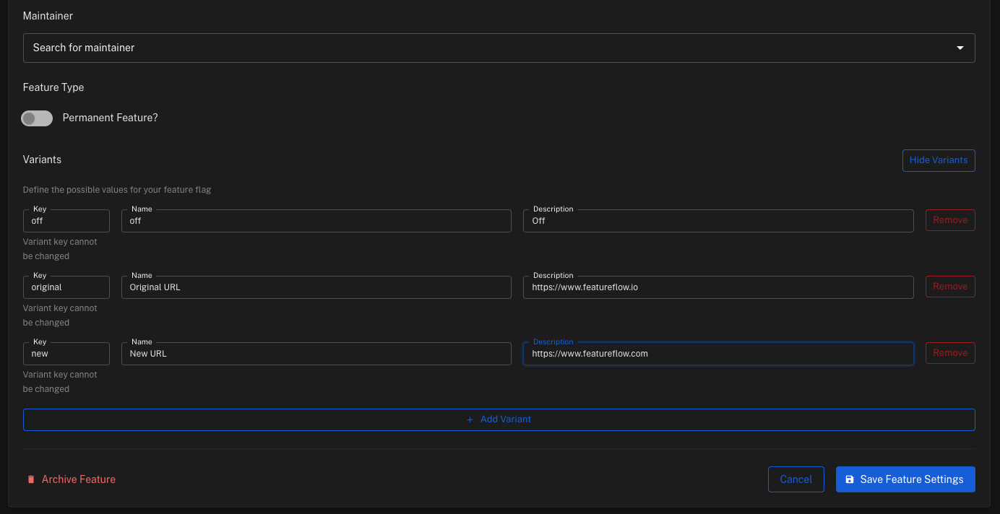
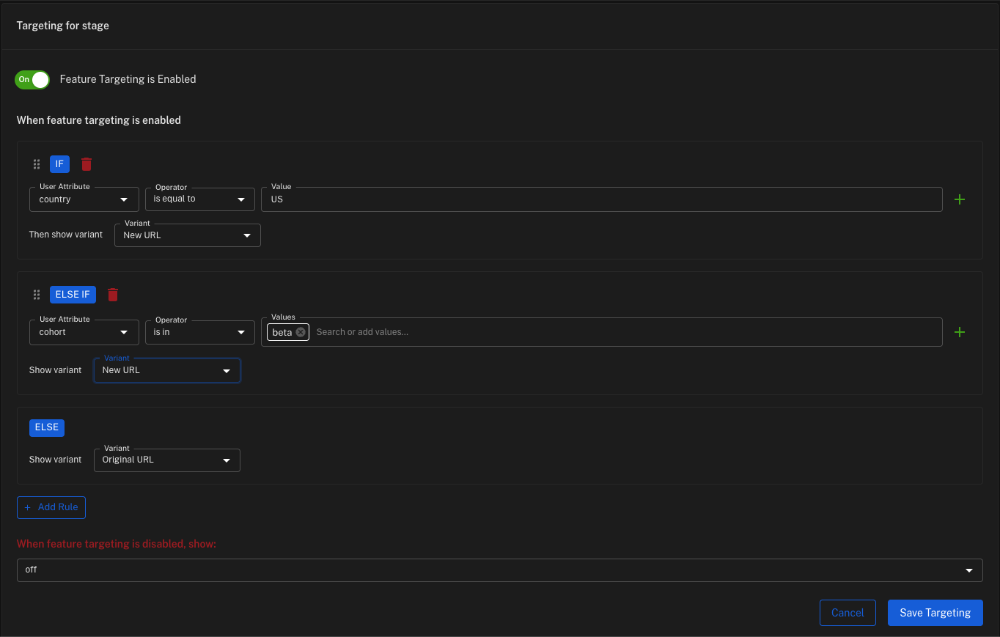

# Featureflow Lambda@Edge example

A minimal TypeScript example using [Featureflow](https://featureflow.io) with AWS Lambda@Edge and the Serverless framework. The function redirects users to different URLs based on feature variants and request headers (e.g. country, cohort).

See in action at https://www.youtube.com/watch?v=VbcLbwJirGo

## Requirements

- Node.js 14+
- An AWS account and a CloudFront distribution (this example uses the `origin-request` event)
- [Serverless Framework](https://serverless.com/framework/docs/getting-started/)

## Project structure

- `src/handler.ts` — Lambda@Edge handler (TypeScript). Compiled automatically by Serverless v4’s built-in esbuild during `serverless dev`, `serverless invoke local`, and `serverless deploy`.
- `serverless.yml` — Serverless, Lambda@Edge, and build (esbuild) configuration.

## IAM Role for the function

The function has a very basic IAM role set up that will be created by `serverless`. The role has access to write to CloudWatch logs and it can be assumed by `lambda` and `edgelambda` services. For production, the logs should be more restrictive than the AWS managed `AWSLambdaBasicExecutionRole`.

## Set your Server API key

Set the `FEATUREFLOW_SERVER_KEY` environment variable to your Server API key, or replace the default in `src/handler.ts`:

```ts
const featureflow = new Featureflow.Client({
  apiKey: process.env.FEATUREFLOW_SERVER_KEY ?? 'srv-env-YOUR_SERVER_ENVIRONMENT_KEY',
});
```

Sign up at [app.featureflow.com](https://app.featureflow.com) if you don’t have an account.

## Build and deploy

Install dependencies, then deploy. TypeScript is compiled automatically by Serverless’s built-in esbuild (no separate build step):

```bash
npm install
npm run deploy
```

Or deploy with a profile: `serverless deploy --aws-profile=your-profile`.

Use an AWS profile with permission to create CloudFormation stacks, S3 buckets, etc. See the [Serverless AWS credentials docs](https://serverless.com/framework/docs/providers/aws/guide/credentials/). Lambda@Edge must be deployed in **us-east-1**. Run `npm run build` to type-check only (no output).

## Serverless Dashboard

The project is wired for the [Serverless Dashboard](https://app.serverless.com). In `serverless.yml`, set `org` and `app` to your org and app (create them at [app.serverless.com](https://app.serverless.com) if needed). Then set your access key and deploy:

```bash
export SERVERLESS_ACCESS_KEY=your-access-key
serverless deploy --aws-profile=your-profile
```

See the [Dashboard setup guide](https://www.serverless.com/framework/docs/guides/dashboard) for details.

## Invoke locally

Because this is a **Lambda@Edge** (CloudFront) function, it isn’t triggered by a normal HTTP URL. You test the handler by invoking it with a CloudFront-style event. Serverless’s built-in esbuild compiles TypeScript automatically—no separate build step.

**1. Invoke with a local event file:**

```bash
sls invoke local -f redirect -p events/cloudfront-request.json
```

Or: `npm run invoke:local`

To test **warm** invocations (one Node process, handler called repeatedly so the Featureflow client stays hot), run `npm run invoke:warm`. It compiles with `tsc`, loads the handler once, then invokes it every second (or set `INVOKE_INTERVAL_MS=2000` for 2s). Press Ctrl+C to stop. This avoids the hang you get when running `serverless invoke local` in a loop.

You should see the function’s response (e.g. a 302 with `Location` header) printed. The sample event in `events/cloudfront-request.json` uses `country=US` and `cohort=beta`; edit that file to test other header values.

**2. With `serverless dev`**

Running `serverless dev` compiles TypeScript via the built-in esbuild, connects to the Serverless Dashboard, and streams logs. It does **not** start a local HTTP endpoint for this service, since the function is only triggered by CloudFront. Use `sls invoke local` as above to run the handler with a test event.

**3. After deploy (real “REST” call)**

Once deployed and attached to a CloudFront distribution, the function runs on every matching request. The only way to “REST invoke” it is to send a request to your **CloudFront URL** (e.g. `https://your-distribution-id.cloudfront.net/`). The edge function then runs and can return the redirect response.

## Test event (AWS Console)

In the Lambda view in the AWS console you can click **Test** and use an event like:

```json
{
  "Records": [
    {
      "cf": {
        "config": {
          "distributionId": "EXAMPLE"
        },
        "request": {
          "uri": "/",
          "method": "GET",
          "clientIp": "2001:cdba::3257:9652",
          "headers": {
            "cloudfront-viewer-country": [
              {
                "key": "US",
                "value": "US"
              }
            ],
            "x-cohort": [
              {
                "key": "beta",
                "value": "beta"
              }
            ],            
            "user-agent": [
              {
                "key": "User-Agent",
                "value": "Test Agent"
              }
            ],
            "host": [
              {
                "key": "Host",
                "value": "d123.cf.net"
              }
            ],
            "cookie": [
              {
                "key": "Cookie",
                "value": "SomeCookie=1; AnotherOne=A; X-Experiment-Name=B"
              }
            ]
          }
        }
      }
    }
  ]
}
```


## Trigger from CloudFront

On the AWS console for Lambda, find the function and click on _Deploy to Lambda@Edge_. 

On the next screen you will need to select which distribution you are deploying to and on which event, select `viewer request` event.

Viewer request is evaluated _before_ the cache is hit, otherwise the cache would continue to return with the first evaluated variant.

### First step


### Second step


After the function is deployed make a request to the cloudfront url, you should be redirected to the failover endpoint.

Note that the logs will be written to a region that is close to the CDN edge node that is serving you. For example even though the Lambda is in `us-east-1` it is now deployed throughout the distribution and if you are in France for example the logs of the edge function will be written to the Paris region.

## Configure featureflow

Create a feature in the featureflow console with a matching key (for example `lambda-redirect`)

If you wish, you can create custom variants to better reflect your redirect rules:



Then you can target the variants using rules based on the user attributes obtained from the header and cookie values:



See https://docs.featureflow.io/using-featureflow-with-aws-lambda for more details.

See https://www.youtube.com/watch?v=VbcLbwJirGo for a 2-minute video example


