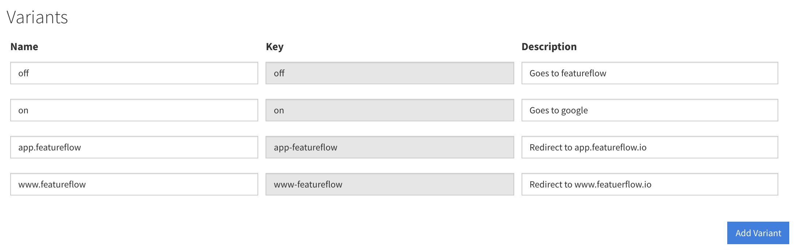
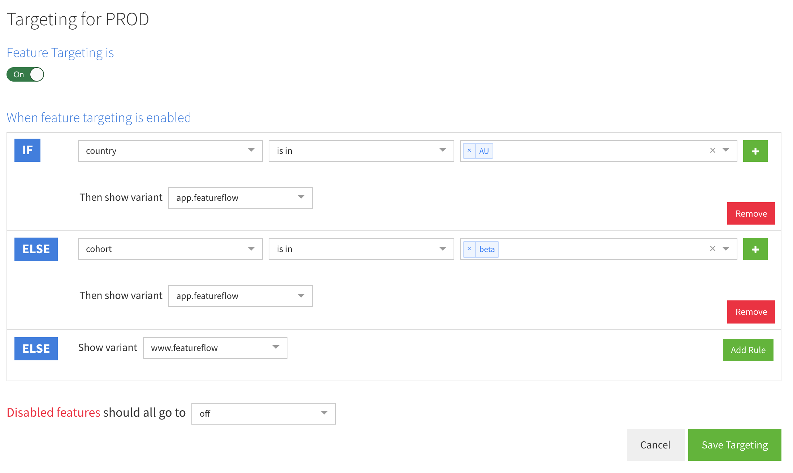

# Example Node.JS Lambda@Edge blue/green deployment using featureflow 

A simple application written in Node.JS with the serverless framework and featureflow that runs on AWS Lambda@Edge.

This application uses featureflow to redirect the user to one endpoint or another based on header values.

See in action at https://www.youtube.com/watch?v=VbcLbwJirGo

## Requirements

 - An AWS account that is set up
 - A cloudfront distribution (as we would like to trigger it on `origin-response`)
 - [Serverless framework](https://serverless.com/framework/docs/getting-started/)

 ## IAM Role for the function

The function has a very basic IAM role set up that will be created by `serverless`. The role has access to write to CloudWatch logs and it can be assumed by `lambda` and `edgelambda` services. For production, the logs should be more restrictive than the AWS managed `AWSLambdaBasicExecutionRole`.

## Set your environment SDK key
Replace `{apiKey: 'sdk-srv-env-YOUR-KEY'}` in `handler.js` with your Server Environment SDK Key.

If you don't have a featureflow account - head to https://app.featureflow.io and sign up, it only takes 1 minute.

## How to deploy

 Set up a profile that has access to create cloudformation templates, access S3 etc. Please check the relevant [documentation of serverless](https://serverless.com/framework/docs/providers/aws/guide/credentials/).

```bash
serverless deploy --aws-profile=my-profile-name
```

The command above will deploy the lambda function. For Lambda@Edge it is important to deploy to `us-east-1` as that is where the function will be distributed to CloudFront.

## Test
In the lambda view click 'test' and create an event, for example:

```json
{
  "Records": [
    {
      "cf": {
        "config": {
          "distributionId": "EXAMPLE"
        },
        "request": {
          "uri": "/",
          "method": "GET",
          "clientIp": "2001:cdba::3257:9652",
          "headers": {
            "cloudfront-viewer-country": [
              {
                "key": "US",
                "value": "US"
              }
            ],
            "x-cohort": [
              {
                "key": "beta",
                "value": "beta"
              }
            ],            
            "user-agent": [
              {
                "key": "User-Agent",
                "value": "Test Agent"
              }
            ],
            "host": [
              {
                "key": "Host",
                "value": "d123.cf.net"
              }
            ],
            "cookie": [
              {
                "key": "Cookie",
                "value": "SomeCookie=1; AnotherOne=A; X-Experiment-Name=B"
              }
            ]
          }
        }
      }
    }
  ]
}
```


## Trigger from CloudFront

On the AWS console for Lambda, find the function and click on _Deploy to Lambda@Edge_. 

On the next screen you will need to select which distribution you are deploying to and on which event, select `viewer request` event.

Viewer request is evaluated _before_ the cache is hit, otherwise the cache would continue to return with the first evaluated variant.

### First step


### Second step


After the function is deployed make a request to the cloudfront url, you should be redirected to the failover endpoint.

Note that the logs will be written to a region that is close to the CDN edge node that is serving you. For example even though the Lambda is in `us-east-1` it is now deployed throughout the distribution and if you are in France for example the logs of the edge function will be written to the Paris region.

## Configure featureflow

Create a feature in the featureflow console with a matching key (for example `lambda-redirect`)

If you wish, you can create custom variants to better reflect your redirect rules:



Then you can target the variants using rules based on the user attributes obtained from the header and cookie values:



See https://docs.featureflow.io/using-featureflow-with-aws-lambda for more details.


